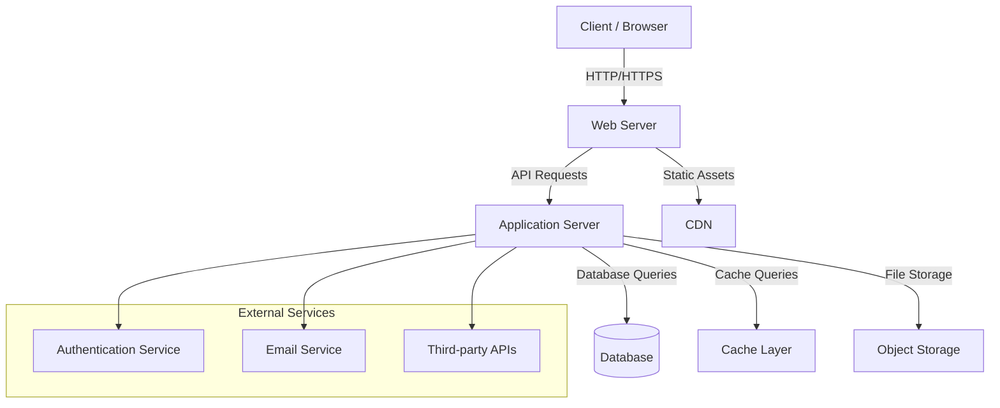

# Architecture Overview

Below is a Mermaid diagram that outlines a typical architecture overview for a web application. You can customize the components and connections according to your project's specifics.

**Legend:**
- **Client / Browser:** End-user interface (e.g., web/mobile app)
- **Web Server:** Handles incoming HTTP requests, serves static files, reverse proxies to app server
- **Application Server:** Main application logic and API endpoints
- **Database:** Persistent data storage (SQL/NoSQL)
- **Cache Layer:** In-memory cache (e.g., Redis, Memcached)
- **Object Storage:** File uploads, media (e.g., S3)
- **CDN:** Content Delivery Network for static assets
- **External Services:** Integrations such as authentication, email, and APIs